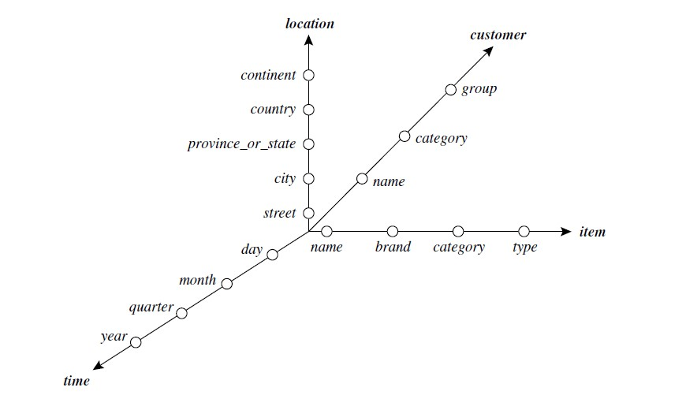

[Volver al Indice](README.md)

Un modelo de consulta de red estrella para consultar bases de datos multidimensionales
 
La consulta de bases de datos multidimensionales puede basarse en un modelo de red estrella, que consiste en líneas radiales que emanan de un punto central, donde cada línea representa una jerarquía de conceptos para una dimensión. Cada nivel de abstracción en la jerarquía se llama huella. Estos representan las granularidades disponibles para su uso por las operaciones OLAP, como el desglose y el roll-up.

Red de estrella. Un modelo de consulta de de red estrella para el almacén de datos de AllElectronics se muestra en
Figura 4.13. Esta red en estrella consta de cuatro líneas radiales, que representan jerarquías de conceptos para las dimensiones ubicación, cliente, artículo y tiempo, respectivamente. Cada línea consta de huellas que representan los niveles de abstracción de la dimensión. Por ejemplo, la línea de tiempo tiene cuatro huellas: "día", "mes", "trimestre" y "año". Una jerarquía de conceptos puede involucrar un solo atributo (por ejemplo, fecha para la jerarquía de tiempo) o varios atributos (por ejemplo, la jerarquía de conceptos para ubicación involucra los atributos calle, ciudad, provincia o estado y país). Para examinar las ventas de artículos en AllElectronics, los usuarios pueden acumular la dimensión de tiempo de un mes a otro o, digamos, profundizar en la dimensión de ubicación de un país a otra ciudad.
Las jerarquías de conceptos se pueden utilizar para generalizar datos reemplazando valores de bajo nivel (como "día" para la dimensión de tiempo) por abstracciones de nivel superior (como "año"), o para especializar datos reemplazando abstracciones de nivel superior con -valores de nivel.

